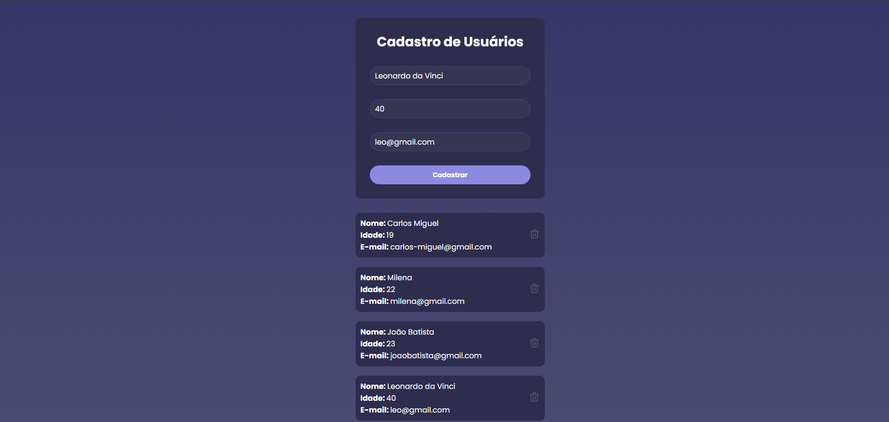

# User Management Frontend

Frontend application for user management built with React and Vite, consuming a REST API developed with Node.js, Express and Prisma.

The project allows creating, listing and deleting users through a clean and responsive interface.

---

# Preview



---

# Technologies

* React
* Vite
* JavaScript (ES6+)
* CSS3
* Axios
* REST API Integration

---

# Features

* Create new users
* List registered users
* Delete users
* API integration with Axios
* Responsive UI
* Component-based structure

---

# Project Structure

```bash
user-management-frontend
│
├── public
├── src
│   ├── assets
│   ├── services
│   │   └── api.js
│   ├── pages
│   │   └── Home
│   │       ├── index.jsx
│   │       └── style.css
│   ├── main.jsx
│   └── index.css
│
├── package.json
├── vite.config.js
└── README.md
```

---

# Getting Started

## 1. Clone the repository

```bash
git clone https://github.com/mictalks/user-management-frontend.git
```

## 2. Access the project folder

```bash
cd user-management-frontend
```

## 3. Install dependencies

```bash
npm install
```

## 4. Run the project

```bash
npm run dev
```

The application will run locally at:

```bash
http://localhost:5173
```

---

# Backend Integration


This frontend consumes the User Management API available locally on:

```bash
http://localhost:3000/usuarios
```

This project consumes a separate backend API built with Node.js, Express and Prisma.

Repository:
https://github.com/mictalks/user-management-api

Example Axios configuration:

```javascript
import axios from 'axios'

const api = axios.create({
  baseURL: 'http://localhost:3000'
})

export default api
```

---

# API Endpoints

| Method | Endpoint      | Description    |
| ------ | ------------- | -------------- |
| GET    | /usuarios     | List all users |
| POST   | /usuarios     | Create user    |
| DELETE | /usuarios/:id | Delete user    |

---

# Learning Goals

This project was developed to practice:

* React fundamentals
* useState, useEffect and useRef hooks
* API consumption with Axios
* CRUD operations
* Component organization
* State management
* Frontend and backend integration
* Responsive styling

---

# Future Improvements

* Edit users
* Form validation
* Toast notifications
* Loading states
* Error handling
* Authentication
* Search and filters
* Deploy with Vercel
* Responsivity

---

# Author

Milena Coyado

Frontend Developer focused on React and modern web applications.

* GitHub: [https://github.com/mictalks](https://github.com/mictalks)
* LinkedIn: [https://linkedin.com/in/milenacoyado](https://linkedin.com/in/milenacoyado)
* Instagram: [https://instagram.com/mictalks](https://instagram.com/mictalks)
